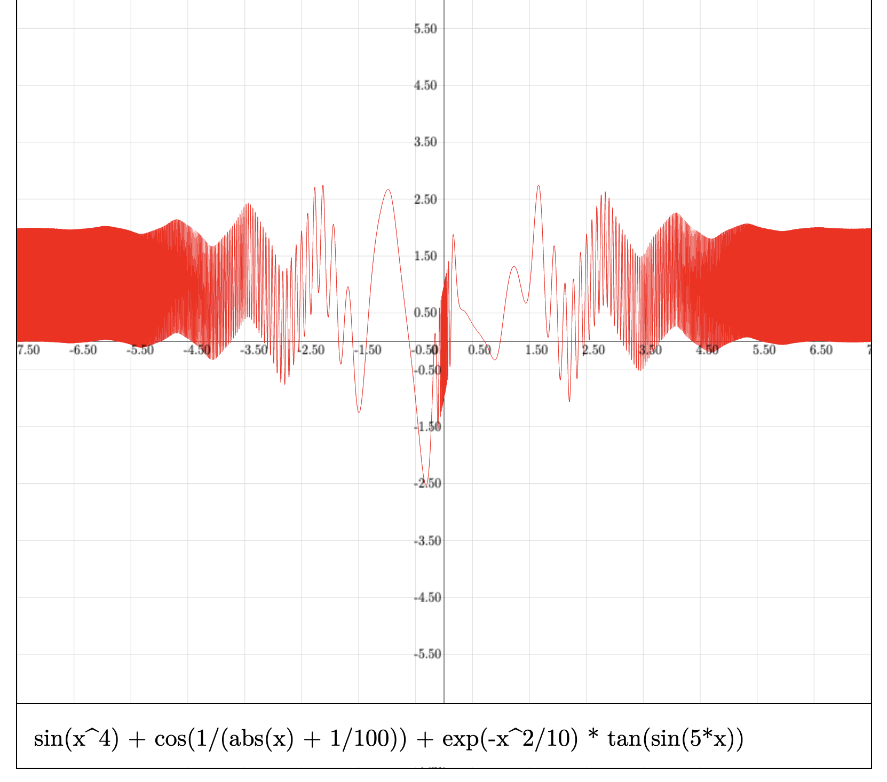
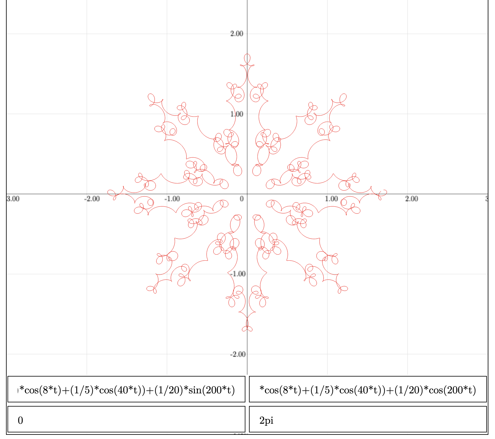

# Functions grapher

[Demo](https://parad83.github.io/analysim/) - [Repo](https://github.com/parad83/analysim)

<p float="left">
  
  
</p>

GPU-accelerated function parser and grapher built in WebGL and JavaScript. Functions are parsed into [S-expressions ](https://en.wikipedia.org/wiki/S-expression) with [Pratt parsing](https://en.wikipedia.org/wiki/Operator-precedence_parser#Pratt_parsing) algorithm and evaluated on the GPU.

When evaluating the S-expression, each operator and function is replaced with a respective GLSL function and later compiled into a unique vertex shader.

The parser(s) work(s) with the following operators: `+`, `-`, `*`, `/`, `^`, functions: `sin`, `cos`, `tan`, `sqrt`, `exp`, `ln`, `abs` and parentheses.

Besides standard functions one can graph parametric functions and set interval for the parameter.

## How to run locally

Clone the project to your local machine and use python to serve it.

```bash
git clone https://github.com/yourname/project
cd project
python -m http.server
```

_(or_ `python` _depending on your python installation)_

Then open in a [compatible](https://get.webgl.org/) browser:

```txt
http://localhost:8000
```

## todo

- [ ] add decimal support,
- [ ] add delete function support,
- [ ] add equation support,
- [ ] add touchpad movements,
- [ ] idk:w
